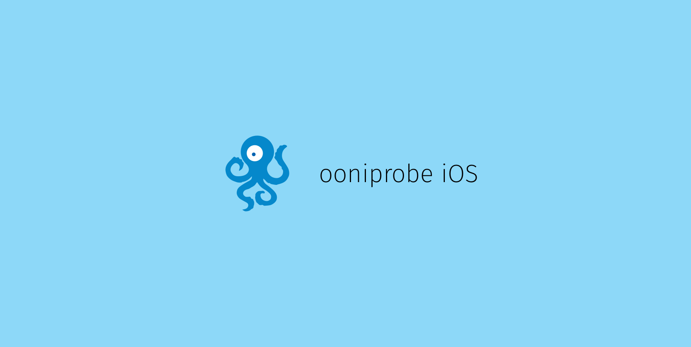

[](https://ooni.torproject.org/)

[](https://slack.openobservatory.org/)

This is the iOS version of [ooniprobe](https://ooni.torproject.org/).

Download it on the [App Store](https://itunes.apple.com/us/app/id1199566366).

[](https://itunes.apple.com/us/app/id1199566366)

If you are interested in building the app yourself, read on.

To download and install the measurement-kit library we use [CocoaPods](https://cocoapods.org).

To install cocoapod use

```
sudo gem install cocoapods # brew install cocoapods on macOS
```

Then use the command:

```
pod install
```

This command will install the latest stable binary measurement-kit library
and its dependencies and install the frameworks inside the Xcode Workspace.

Then open the xcode workspace (not the xcode project!)  located in
`ooniprobe.xcworkspace` and click on run to build it.

### How to complile a specific version of measurement-kit for an Xcode project.

You can use a specific version of [measurement-kit](https://github.com/measurement-kit/measurement-kit) it in your project by adding this line in your Podfile:

    pod 'measurement_kit',
      :git => 'https://github.com/measurement-kit/measurement-kit.git'

You can use a specific branch, e.g.:

    pod 'measurement_kit',
      :git => 'https://github.com/measurement-kit/measurement-kit.git',
      :branch => 'branch-name'

Similarly, you can use a specific tag, e.g.:

    pod 'measurement_kit', 
      :git => 'https://github.com/measurement-kit/measurement-kit.git',
      :tag => 'v0.x.y'

Then type `pod install` and open `.xcworkspace` file (beware not to open the
`.xcodeproj` file instead, because that alone won't compile).

## Managing translations

To manage translations ensure you have installed the [transifex command line
tools](https://docs.transifex.com/client/installing-the-client).

### Pushing source text

To push the source of the translation run:

```
tx push -s
```

### Pulling translations

To pull in translations run:

```
tx pull
```

or

```
tx pull -l [lang_code]
```

to pull only a specific language


### Generating descriptions for market

To generate translated descriptions for the markets run:

```
python scripts/gen-descriptions.py [lang_code]
```

Where `lang_code` is the language code for the description you want to
generate.

This will print to standard output the translated text that you can then copy
and paste into the market descriptions.

If a string is not translated it will print the source for the text.

## Contributing

* Write some code

* Open a pull request

* Have fun!

