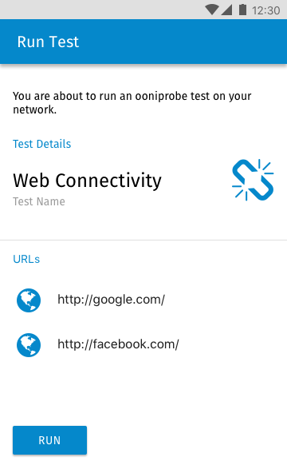

# Mobile Deep Linking Specification

Version: v1.0.0

This document defines mobile deep linking support inside of ooniprobe-ios and
ooniprobe-android. Mobile Deep Linking is the ability to trigger actions inside
of the application by means of clicking on URLs specifying a custom URI schema,
in our case using the schema `ooni://`.

## Usage Examples

### Example 1: Embedding a widget on a websites that triggers ooniprobe measurements

Use case: I am a site owner and I am interested in encouraging users to run
ooniprobe to test some specific sites I care about. I will add a widget to my
site that when clicked will test those sites via ooniprobe.

* Site owner places a button on their site that says "Test for censorship with ooniprobe"

* A user of the ooniprobe mobile app clicks on the button

* The mobile app will open showing what measurements the user is about to run

* When the user confirms, by clicking on "Yes, run this now", such
  preconfigured ooniprobe test will run

## Link Specification and Parameters

This is the specification of the parameters for mobile deep linking in the ooniprobe mobile apps.

The base URI scheme looks like this:

```
ooni://<action>?<parameters>
```

### Running tests

This URI defines how network measurement tests can be triggered via mobile deep linking.

The URI in this case looks like the following:

```
ooni://nettest?param-name=param-value&param-name=param-value&...
```

Where `param-name` can be any of the one in the following table:

| Parameter name | Type  | Required | Description  | Example Value |
|------------- --|-------|----------|--------------|---------------|
| `mv`           | STR   | YES      | Minimum Version of ooniprobe required to run this test | `1.1.5` |
| `tn`           | STR   | YES      | Test Name of the test to run | `web_connectivity` |
| `ta`           | JSON  | YES      | Test Arguments to pass to the test encoded as JSON | `{"urls": ["http://one.example.com","http://two.example.com"]}` |
| `td`           | STR   | NO       | Test description, this is a message that will be showed in the confirmation UI | `This test will check reachability of example.com domains` |

When the URI is clicked on and the ooniprobe app is opened it shall show a
confirmation page that informs the user of which test they are about to run. A
test will be run only once they click on the run button.

Optional: the user should also have the ability to edit some of the parameters
for the test they are about to run.

See the mockup below:


